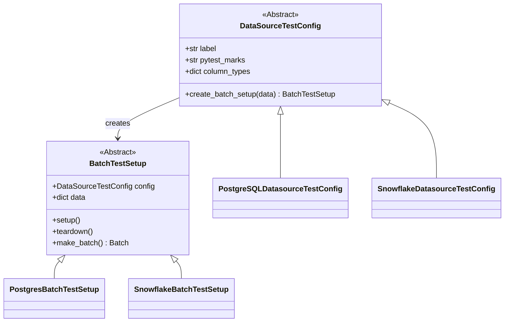
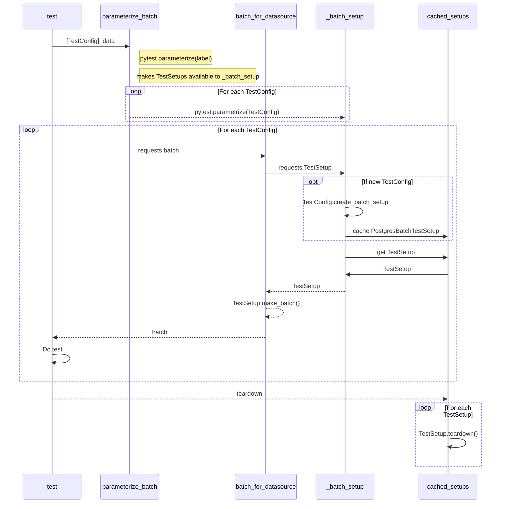

# DataSource and Expectation Integration Tests
Most of the tests in this directory make use of a few utilities that help load data into various data sources.
The following sections provide an overview of how it works.

## Overview of the primary classes

The following is a rough class diagram of the main classes involved in test testing utilities.
* DataSourceTestConfig is the public interface; instance are passed to `parameterize_batch_for_data_sources`
    * Holds optional schema information
    * Knows about pymarks
* BatchTestSetup these are instantiated behind the scenes
    * Holds data
    * Knows about the actual data source
    * Sets up / tears down data



## Overview of the main flow
The following shows the rough flow when running tests with `parameterize_batch_for_data_sources` and the `batch_for_datasource` fixture.

Some names have been truncated in the the diagram

An overview of the main pieces:

* test: this is the test you are writing
* parameterize_batch: `parameterize_batch_for_data_sources`
* `batch_for_datasource`: fixture that pulls in the batch for you
* _batch_setup: `_batch_setup_for_datasource`. fixture that handles caching test configs and calling setup
* cached_setups: ensures that identical TestSetups are only setup / torn down once to improve performance



## Onboarding a new SQL backend

`SqlDatasourceTestConfig` (a `DataSourceTestConfig` subclass) and `SQLBatchTestSetup` (a
`BatchTestSetup` subclass) are shared across every SQL dialect. A new SQL backend does not add a
new class shaped like the diagram above; it adds one declaration that the shared classes already
know how to read. The declaration is a frozen dataclass,
`tests/integration/test_utils/data_source_config/backend_spec.py::SqlBackendSpec`, and everything
below is about writing one, wiring it up, and proving both are done correctly.

The steps, in order: declare the record, choose tiers, add the wiring entries, register the
config, run the wiring drift check, run the backend's suite locally. SingleStore
(`tests/integration/test_utils/data_source_config/singlestore.py`) is the newest backend onboarded
this way and is the worked example throughout.

### 1. Declare the record

A concrete config subclasses `SqlDatasourceTestConfig` and states its `BACKEND_SPEC` as a class
variable, once:

```python
@register_sql_backend
class SingleStoreDatasourceTestConfig(SqlDatasourceTestConfig):
    BACKEND_SPEC = SqlBackendSpec(
        label="singlestore",
        marker="singlestore",
        provisioning=BackendProvisioning.LOCAL_CONTAINER,
        ci_lane=CiLaneRef(workflow_job="marker-tests", marker_token="singlestore"),
        uses_schema=False,
        tiers=frozenset({BackendTier.CURATED_SQL}),
        column_type_overrides={str: sqltypes.VARCHAR(255)},
        dev_requirements_file="reqs/requirements-dev-singlestore.txt",
        task_runner_marker="singlestore",
        container_service="singlestore",
    )
```

`label` and `marker` are identity: `label` appears in the parameterized test id, `marker` names
the pytest mark (they can differ — SQL Server's label is `mssql`, its marker is `sql_server`).
`provisioning` is one of `LOCAL_CONTAINER`, `LOCAL_FILE`, or `EXTERNAL_CREDENTIALS`, and
`container_service` is required with, and only with, `LOCAL_CONTAINER`. Everything else on the
record is an extension point: a declared fact that lets the shared `SQLBatchTestSetup` do the
right thing for this dialect without an `if dialect == ...` branch inside it. If a backend needs a
fact the record has no field for, the fix is to add the field to `SqlBackendSpec` and give it a
docstring explaining the dialect problem it solves — not to special-case the backend inside the
shared setup or work around the gap locally in the backend's own module.

#### Extension points and the dialect problem each one solves

- **`uses_schema`** — not every backend supports schema-scoped objects the way PostgreSQL,
  MySQL, SQL Server, Snowflake, BigQuery, Databricks, and Redshift do. SQLite, SingleStore, and
  the ad-hoc escape hatch declare `uses_schema=False`; the shared setup then never attempts to
  create or target a schema for them. Supplying a schema name to a backend that declares no
  schema support raises `ValueError("Schema name provided but use_schema is False for this
  datasource type.")` — verbatim, unchanged by this declaration mechanism.
- **`column_type_overrides`** — some dialects reject a bare, length-less `VARCHAR`. MySQL,
  Databricks, SingleStore, and the ad-hoc escape hatch all declare
  `column_type_overrides={str: sqltypes.VARCHAR(255)}`; the shared setup merges this mapping over
  its own default Python-type-to-SQLAlchemy-type inference before creating any table.
- **`transaction_mode`** — not every backend supports an explicit `COMMIT`. Databricks declares
  `transaction_mode=TransactionMode.AUTOCOMMIT`; the shared setup's commit helper reads this off
  the declaration instead of inspecting the connection's dialect, and skips the `conn.commit()`
  call for a backend that declares it.
- **`insert_parameter_limit`** — some backends cap the number of bound parameters a single
  `INSERT` can carry. Databricks declares `insert_parameter_limit=250`; the shared insert path
  reads this to decide whether to chunk a bulk insert, and by how much. A backend with no limit
  omits the field and gets a single unchunked statement.
- **`table_schema_items`** — a dialect-specific storage-engine construct (for example, a
  storage-engine clause some dialects require on `CREATE TABLE`) is not accepted as a SQLAlchemy
  `Table` keyword argument at all; it has to be supplied positionally, alongside the generated
  columns. This field is a zero-argument factory, not a stored instance, returning a fresh
  sequence of such items on every call. That is deliberate, not incidental: a construct like this
  binds to the first `Table` it is attached to, so reusing one instance across two tables would
  corrupt the second table's schema. The shared setup calls the factory once per table it
  creates — once for the primary table, once per extra table — never once for the whole setup.
  No registered backend needs this today; it is exercised by throwaway declarations in
  `tests/integration/test_utils/test_sql_batch_test_setup.py`, which is the place to look for how
  it is expected to be used.

#### Two rules a first-time onboarder will get wrong

**1. A backend module must import successfully with its driver package absent.** The harness
package (`tests/integration/test_utils/data_source_config/__init__.py`) imports every backend
module unconditionally, and the shared verification lane (`tests/test_sql_backend_registry.py`,
which runs under the `project` marker) installs no SQL driver at all. If a backend's module raises
on import in that lane, the whole package fails to import, which takes down every other backend's
tests along with it, since the whole suite is collected from one package.

A driver import or attribute dereference that would raise when the driver package is missing must
not sit at module scope unguarded. There are three acceptable shapes, and which one applies
depends on the field:

- **Defer it inside a method or factory.** This is available for any field whose declared type is
  itself a callable — `table_schema_items` is the only one today. Storing the factory function,
  rather than its result, means the dialect-specific work happens only when the factory is
  actually called, which is only when a test selected for that backend is running and its driver
  is installed.
- **A lazy compatibility-style accessor for the values**, i.e. referencing dialect-specific
  values through a compatibility layer that resolves to a safe stand-in when the underlying
  package is absent instead of raising — the pattern `great_expectations.compatibility.sqlalchemy`
  already uses for SQLAlchemy itself. Where such a shim exists for the values a backend needs, it
  can be referenced freely at module scope.
- **A mapping built at module scope behind an import guard that yields an empty mapping when the
  driver package is absent.** This is explicitly permitted — not a workaround. Where a backend's
  override values come from its driver, and no compatibility shim covers them, this is the only
  shape left: deferral is not available for that field the way it is for `table_schema_items`, because `column_type_overrides` is declared as a
  `Mapping`, not a `Callable`. Wrapping the driver-dependent construction in a function and
  calling that function at declaration time still evaluates it — and still raises — at import
  time, because it is the *value* that gets stored in the record, not a callable that could defer
  it. A backend whose override values come from its driver therefore writes something like:

  ```python
  try:
      import some_dialect_package

      _COLUMN_TYPE_OVERRIDES = {str: some_dialect_package.types.VARCHAR(255)}
  except ImportError:
      _COLUMN_TYPE_OVERRIDES = {}
  ```

  and passes `_COLUMN_TYPE_OVERRIDES` as `column_type_overrides=...`. Note this guard is only
  needed for values a driver supplies. Every backend shipping today takes its override from core
  SQLAlchemy through the compatibility layer and declares it unguarded, which is the ordinary
  case; reach for the guard only when the values genuinely come from the driver. The consequence
  of the guarded shape is that the
  declared record becomes environment-dependent: populated where the driver is installed, empty
  where it is not. That is safe because the mapping's only consumer is type inference during
  table construction, which only runs inside a test that has already been selected for that
  backend's marker — but it also means no assertion about the override mapping's *contents* can
  run in the driver-free lane. Such an assertion has to run under the backend's own marker,
  where the driver is actually installed.

**2. Dialect table schema items are supplied by a factory returning positional items, not a
stored instance.** Covered above under `table_schema_items`, but worth restating on its own: such
constructs are not accepted as `Table` keyword arguments, and each table needs its own freshly
constructed items because the construct binds to the first table it is attached to.

### 2. Choose tiers

`tiers` is a `FrozenSet[BackendTier]`. Membership in `BackendTier.STANDARD_SQL` puts a backend in
the shared standard SQL data-source list (`SQL_DATA_SOURCES`); membership in
`BackendTier.CURATED_SQL` puts it in the smaller curated suite
(`tests/integration/data_sources_and_expectations/test_curated_backend_suite.py`), which every
curated-tier backend inherits without editing that module. Always write the declaration form,
never a bare set literal:

```python
tiers=frozenset({BackendTier.CURATED_SQL})
```

`{BackendTier.CURATED_SQL}` alone is a `set`, and mypy rejects a `set` against the `FrozenSet`
field — `tests/` is inside mypy's checked files, so that is a hard failure, not a lint note. A
backend joining both tiers writes `frozenset({BackendTier.STANDARD_SQL, BackendTier.CURATED_SQL})`;
one joining neither omits the field.

**Excluding one case.** If a curated-tier backend joins the tier but one specific case in the
curated suite is not meaningful for its dialect, the supported way to record that is a per-case
entry in `tier_case_exclusions`, keyed by the suite's published case key, with a required reason:

```python
tier_case_exclusions={"quoted_identifiers": "this dialect has no reserved-word column names"}
```

The wrong shapes are withdrawing the backend from the tier entirely (that throws away every case
the backend *does* pass) and adding a backend-specific `if` inside a shared case in the suite
module (that reintroduces the per-dialect branching the tier mechanism exists to avoid). The
exclusion accessor (`data_sources_for_tier_case`) is the only place an exclusion takes effect —
every case in the curated suite is parameterized through it rather than over the raw tier list,
specifically so a downstream backend's exclusion is honored no matter which case asks.

**The per-case exclusion ceiling.** A backend may declare at most two entries in
`tier_case_exclusions`, counted over the whole mapping — not per tier. Every exclusion counts
toward the ceiling regardless of what its reason records: an exclusion for observed
non-determinism costs exactly as much coverage as one for a genuine dialect gap. Registering a
config whose declaration carries a third exclusion raises `ValueError` at decoration time, naming
the config class, the count, and every declared key. The remedy the error states is to escalate
that backend's tier participation — for example, dropping it from the tier rather than papering
over three unmet cases — not to raise the ceiling. The count is a property of one declaration in
isolation (it needs no other backend's state and no published key set), which is why it is
enforced at registration rather than by a suite-level check.

The reasoning matters as much as the number. A single exclusion's reason makes *that* exclusion
answerable — a reviewer can read the string and judge it. But a set of exclusions is not
accountable just because each member is: nothing about reading three individually-justified
reasons tells you that, together, they have quietly hollowed out the tier's coverage of that
backend. Only a count does that. A documented limit whose purpose isn't understood is the one the
first inconvenienced maintainer raises instead of respecting — hence writing the reasoning down
here, not just the number.

Two caveats on "not per tier": today `tier_case_exclusions` carries no tier attribution at all —
a key is just a case key, and the ceiling counts however many are declared, full stop. This is
exact only because `BackendTier.CURATED_SQL` is currently the only tier that publishes case keys
a backend can exclude by name. If a second tier ever grows its own per-case exclusion mechanism,
the ceiling as implemented today would count across both tiers combined rather than per tier, and
that would need to be revisited before it could be trusted going forward.

### 3. Add the wiring entries

A declared `dev_requirements_file`, `task_runner_marker`, `container_service`, and `ci_lane` are
promises the record makes about entries that exist elsewhere in the repository. Nothing derives
those entries from the declaration — they have to be added by hand, in the same change that adds
the declaration. Using SingleStore's actual entries as the reference:

- **`pyproject.toml`**, `[tool.pytest.ini_options] markers`: a one-line entry for the marker,
  e.g. `"singlestore: mark a test as SingleStore-dependent.",`.
- **`tests/conftest.py`**, `REQUIRED_MARKERS`: the marker name added to this set, e.g.
  `"singlestore",`.
- **`tasks.py`**, `MARKER_DEPENDENCY_MAP`: an entry keyed by `task_runner_marker` naming the
  requirements file(s) and, for a locally containerized backend, the compose service(s):

  ```python
  "singlestore": TestDependencies(
      ("reqs/requirements-dev-singlestore.txt",),
      services=("singlestore",),
  ),
  ```

- **`.github/workflows/ci.yml`**: the marker token added to the relevant job's marker matrix
  (SingleStore's `ci_lane` names the `marker-tests` job; its token `singlestore` is one entry in
  that job's marker list).
- **`assets/docker/<container_service>/docker-compose.yml`**: the compose file for a
  `LOCAL_CONTAINER` backend, at the directory named by `container_service`. This directory name
  is the compose *directory*, not necessarily the compose *service* name inside it — SingleStore's
  `container_service="singlestore"` names the directory `assets/docker/singlestore/`, whose
  compose file defines a service called `singlestore_db`.
- **`reqs/requirements-dev-<backend>.txt`**: the file named by `dev_requirements_file`, if the
  backend needs one. SQLite needs neither a requirements file nor a task-runner entry, and omits
  both fields.

### 4. Register the config

`@register_sql_backend`, from
`tests/integration/test_utils/data_source_config/registry.py`, decorates the config class and
enrolls its `BACKEND_SPEC` into the process-global registry the harness treats as "the SQL
backends that exist" — the set the derived tier lists, the completeness checks, and the wiring
drift check all walk. Add the new module's import to
`tests/integration/test_utils/data_source_config/__init__.py`, alongside the other backend
modules and before the `tiers` import (that file's own comment explains why the ordering
matters: the derived tier lists are built once, at that module's import time, from whatever the
registry holds at that moment, so a backend module imported after `tiers` would be silently
absent from them even though it registered successfully).

Registration itself runs the completeness check: `_validate_spec` inside `registry.py`, which
raises `ValueError` at decoration time — that is, at import time, since the decorator runs when
the class statement executes — on any of the following. Each message names the offending config
class.

| Failure | Remedy |
|---|---|
| Empty `label` | Give the declaration a non-empty `label`; it appears in the parameterized test id. |
| Empty `marker` | Give the declaration a non-empty `marker` naming the pytest mark. |
| Empty `ci_lane.workflow_job` | Name the workflow job the lane runs in. |
| Empty `ci_lane.marker_token` | Name the marker token that job selects on. |
| `insert_parameter_limit` is zero or negative | Use a positive integer, or omit the field entirely for no chunking limit. |
| `LOCAL_CONTAINER` provisioning declared without `container_service` | Name the compose service that starts this backend. |
| `container_service` declared without `LOCAL_CONTAINER` provisioning | Remove the field, or set `provisioning=BackendProvisioning.LOCAL_CONTAINER` if the backend really is locally containerized. |
| `table_schema_items` declared but not callable | Pass a zero-argument factory function, or omit the field. (Registration checks only that it is callable — it is never invoked at registration time, since calling it would require the backend's driver package, which registration must not assume is installed.) |
| A `tier_case_exclusions` entry has an empty case key | Name the case being excluded. |
| A `tier_case_exclusions` entry has an empty or whitespace-only reason | Record why the case is excluded — an unexplained exclusion is exactly the silent narrowing the mechanism exists to prevent. |
| More than two `tier_case_exclusions` entries | See "The per-case exclusion ceiling" above — escalate this backend's tier participation rather than raising the limit. |
| Duplicate `label` (or `marker`) already registered by another config class | Rename the field; both class names appear in the message. |

Today the registry is populated by nothing more than the package's own modules importing
themselves and running their own `@register_sql_backend` decorators — a deterministic set of
class-level side effects, confined to two dictionaries, with no environment read anywhere in the
process. That is a deliberate replacement for an earlier mechanism in the shared SQL setup module
that read an environment variable and mutated the SQLAlchemy dialect enumeration as a side effect
of that module simply being imported. Importing the harness package today has no side effects
beyond populating the registry from its own declarations; it reads no environment variable and
mutates no shared enum.

### 5. Run the wiring drift check

```
pytest tests/test_sql_backend_wiring.py -m project -q
```

This module (`tests/test_sql_backend_wiring.py`) is a *different* check from the registration
completeness check above: registration validates that one declaration is well-formed in
isolation; the wiring drift check cross-references every *registered* backend's declared
coordinates against the actual files those coordinates point at — `pyproject.toml`,
`tests/conftest.py`, `tasks.py`, `.github/workflows/ci.yml`, and `assets/docker/`. It is
parameterized over the registry, so each backend is its own test case, and it asserts presence
only — never a count, an order, or a structural shape — so it survives unrelated edits to any of
those files. Its failure messages, and their remedies:

| Failure | Remedy |
|---|---|
| `marker` not in `pyproject.toml`'s markers list | Add the marker entry (step 3, first bullet). |
| `marker` not in `REQUIRED_MARKERS` | Add the marker to that set in `tests/conftest.py` (step 3, second bullet). |
| Declared `dev_requirements_file` does not exist on disk | Create the file at the declared path, or fix the declared path. |
| Declared `task_runner_marker` has no `MARKER_DEPENDENCY_MAP` entry, or that entry doesn't list `dev_requirements_file` | Add or fix the entry in `tasks.py` (step 3, third bullet). |
| Declared `ci_lane.workflow_job` has no matching job, or `ci_lane.marker_token` does not appear as a whole token in that job | Add the job, or add the token to that job's marker matrix in `.github/workflows/ci.yml`. Token matching is whole-token, not substring — `redshift` does not match inside `gx-redshift` — so a token that is merely a prefix of one already present still fails. |
| Declared `container_service` has no compose file at `assets/docker/<service>/docker-compose.yml`, or the `MARKER_DEPENDENCY_MAP` entry doesn't list it among its services | Add the compose file, or add the service to the task-runner entry's `services`. |

Verified against the real repository, all nine currently registered backends pass this check with
no configuration file edited as part of writing this document.

### 6. Run the backend's suite locally

Once the config is registered and its wiring entries exist, its marker selects its tests the same
way any other backend's does:

```
pytest tests/integration -m singlestore -q
```

That command, run against a live SingleStore container, produces `11 passed, 3341 deselected`.

Start the container first. Each backend declaring local-container provisioning names a directory
under `assets/docker/`, so `docker compose -f assets/docker/singlestore/docker-compose.yml up -d`
brings this one up; the task runner will also start a marker's services for you if you pass
`--up-services`.

## The per-case exclusion ceiling's registry-side test coverage

The registry test module (`tests/test_sql_backend_registry.py`) is the fastest way to check the
registration-time invariants above without touching a database — it registers throwaway backends
inside an isolation seam that snapshots and restores the real registry, so nothing it does
leaks between test runs or affects `iter_sql_backends()` for any other test:

```
pytest tests/test_sql_backend_registry.py -m project -q
```

## The ad-hoc escape hatch's autocommit mechanism

`GenericSQLDatasourceTestConfig` (`tests/integration/test_utils/data_source_config/generic_sql.py`)
is the escape hatch for testing against a SQL backend that has no dedicated config: it is never
decorated with `@register_sql_backend` and never appears in the registry, so it never gates CI
membership. Its connection string is supplied at construction time, or, if left unset, read from
the `GX_TEST_GENERIC_SQL_CONNECTION_STRING` environment variable when its batch setup is
constructed.

Autocommit for this config has two routes. Neither is read at import; the environment variable is
read when the batch setup is constructed, and the field is folded into the config's own
declaration when the config is constructed:

1. **The `autocommit: bool` field on the config itself.** When `True`, `__post_init__` folds it
   into a per-instance `backend_spec_override` — a copy of `BACKEND_SPEC` with
   `transaction_mode=TransactionMode.AUTOCOMMIT` and, deliberately, a label suffixed
   `_autocommit`. The label change matters: the session-scoped batch-setup cache is keyed on
   config equality, which compares `label`, not this field, so two instances differing only in
   `autocommit` would otherwise collide in the cache and silently share one setup — the second
   instance inheriting the first instance's transaction behavior.
2. **The `GX_TEST_GENERIC_SQL_AUTOCOMMIT` environment variable.** Read by
   `GenericSQLBatchTestSetup.__init__` and OR'd together with the field above. Unlike the field,
   this is process-global rather than per-instance, so it is never folded into the label — every
   escape-hatch setup in one run resolves it identically, so no two cache entries can disagree
   over it the way two differently-configured instances could.

Neither route mutates any module-level state or reads the environment at import time; both are
resolved fresh each time a `GenericSQLBatchTestSetup` is constructed.
